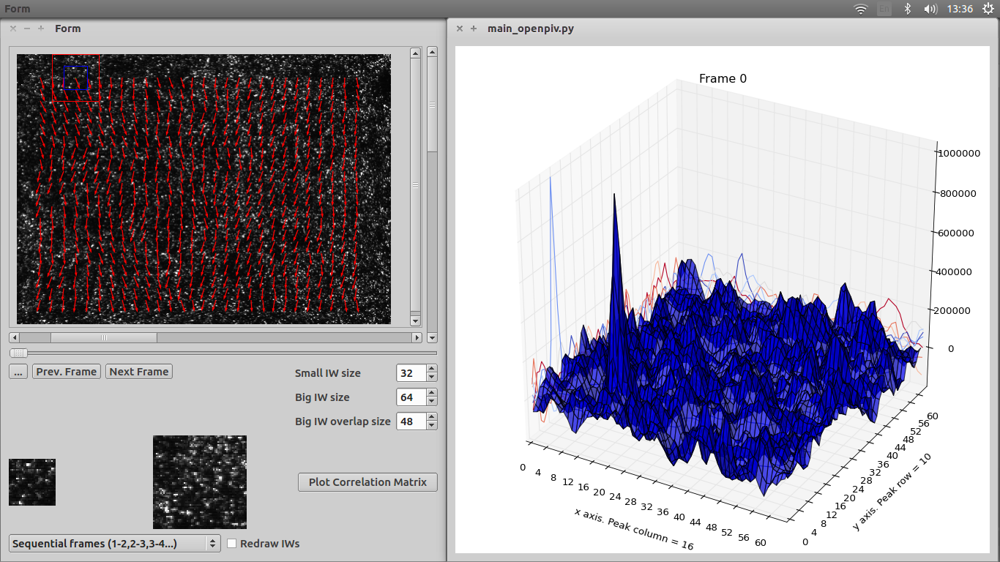

#piv-gui-pyhton
A python GUI for inspecting correlation matrices of Particle Image Velocimetry (PIV) analysis. This GUI currently uses correlation data format of OpenPIV (www.openpiv.net). The user is assumed to be familiar with pyhton OpenPIV.

#Warning
This GUI is still in the alpha stage - it's most likely buggy, and not all buttons are functional.

It's developed in Linux environment, but all the required dependencies are multi-platform (this GUI was tested on Linux/Mac/Win7.)

#Motivation
In essence, PIV relies on statistical "best match" approach, when estimating velocity vectors. While PIV is a well established method, outlier (incorrectly identified) vectors often show up in the calculated flow field. Inspecting correlation matrices can reveal the reason of an outlier vector. This GUI also enables the user to quickly change the Interogation Window size.

#Requirements
OpenPIV and its dependencies, as well as Qt, Sip, an PyQt.
Installation instruction for OpenPIV can be found here: http://openpiv.readthedocs.org/en/latest/src/installation_instruction.html
Installation instructions for Qt, Sip, and PyQt are widely available online, e.g. : http://doc.qt.io/qt-4.8/installation.html, http://pyqt.sourceforge.net/Docs/PyQt4/installation.html.

#Running
Once the repository is cloned, simply navigate to the folder where main.py is and run python main.py. This should hopefully start the GUI. Sample images are included in the repository.

